# Werkstattauftrag W07-Webmin

Inhaltsverzeichnis:
-------------------

# 1. Autoren, Versionierung des Dokumentes
Autoren: Jonah Gutknecht, Thomas Züger
 

# 2. Einfuehrung 
   - Beschreibung: Welche Funktionen wird der Service erfuellen
   - Zeitaufwand: Die Installation von WEBMIN (Werkstatt Auftrag 07) ist bis am 28.09.2021 um 11:05 abgeschlossen.
   - Stolpersteine: Das RaspberryPI Linux image wurde von vorgehenden Schüler übernommen, wodurch möglicherweise wichtige Config-Files bereits angepasst wurden.

# 3. Benoetigte Hard- und Software
   - Hardware (Materialliste, Funktionalitaet)
  1x RaspberryPI v4 (inkl. Stromkabel)
  1x HDMI zu DVI Adapter
  1x HDMI zu miniHDMI Adapter
  1x Externer Bildschirm
  1x Tastatur
  1x Maus
  
   - Software (Anforderungen, Firmware, OS-Image, ergaenzende SW-Packages, Ab-
1x RaspberryPI LInux Image
1x Webmin (aktuellste Version)

	hängigkeiten, Funktionalitaet)

# 4. Installationsanleitung
 (Didaktisch reduzierte Anleitung. Lernende sollen eine eigene Lösungswege realisieren)
 Auf dem RaspberryPI WLAN einrichten.
 Für die Installation von WEBMIN werden zusätzliche Libaries verwendet. Mit folgendem Befehl können diese eingerichtet werden.
 sudo apt-get install libnet-ssleay-perl libio-socket-ssl-perl

Installation der aktuellsten WEBMIN Version 1.981
cd wget http://prdownloads.sourceforge.net/webadmin/webmin-1.981-
minimal.tar.gz

Entpacken der heruntergeladenen .tar.gz Datei:
tar -zxvf webmin-1.981 minimal.tar.gz

In den Ordner mit dem installiertem Setup wechseln und anschliessend die Setup Datei ausführen.
cd webmin-1.881
sudo ./setup.sh

Bei dem Setup kann alles auf default gelassen werden. Empfehlenswert ist das Wechseln des Passwortes. 
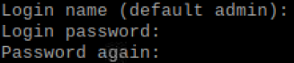

Nach der Installation von Webmin wird die Adresse von Webmin angezeigt. 
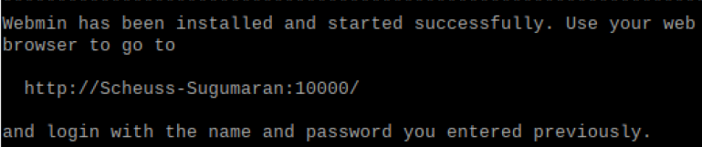

Default Benutzer: admin
Gesetztes Passwort: 12345

Im Webmin Browserfenster können unter dem Punkt «Webmin
Configuration» und dann «Webmin Modules» weiter Module installiert werden.

Mit den drei Punkten auf der rechten Seite können zusätzliche MOdule installiert werden.

Wähle das "useradmin" Modul an und gehe unten links auf "Install"
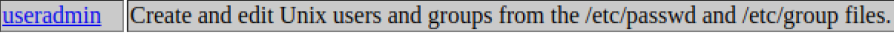

Unter Standard module sollte nun "useradmin" stehen. Anschliessend kann auf "Install Module" geklickt werden.
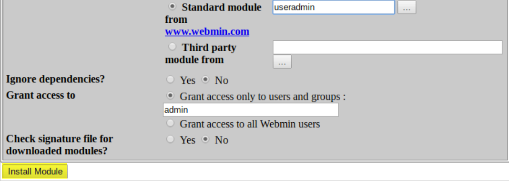

Im Hauptmenu auf "System" und dann auf "User and Groups". In diesem Menu können nun neue User erstellt werden.
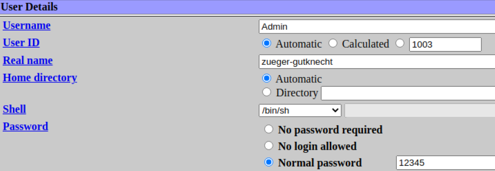

**Admin User Erstellen**

Weiter unten bei "Group Membership" kann der User noch in die Admin Gruppe genommen werden, damit dieser auch Admin Rechte hat.
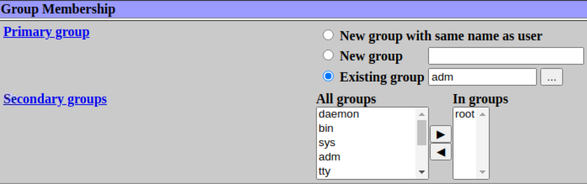
Zum Schluss ganz unten noch auf "create" klicken.

Anschliessend sieht man den erstellten Benutzer in der Liste
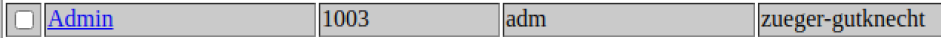

Hier wird noch ein normaler User Account erstellt.
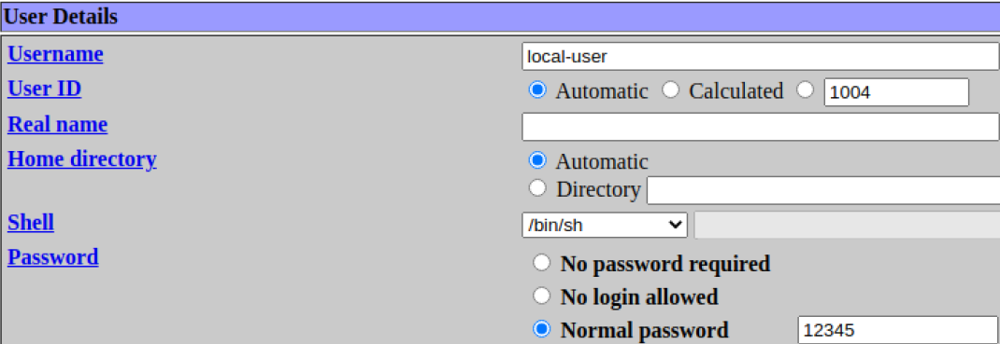

Diesen User einfach in der Gruppe "Users" lassen.
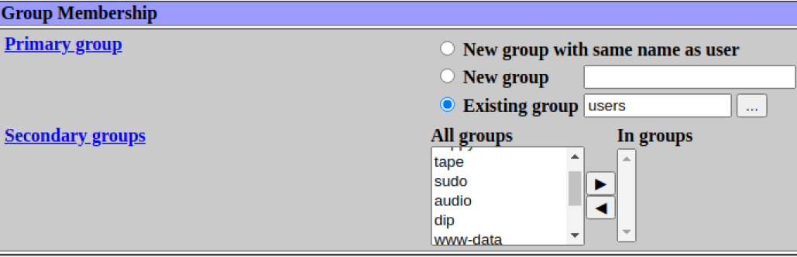

Falls der Admin deaktiviert werden soll, kann einfach der Admin Account ausgewählt und auf "Disable selected" geklickt werden.
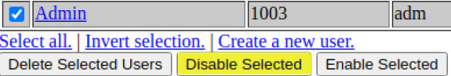

In der Benutzerliste wird der deaktiviert Account jetzt Kursiv angezeigt.
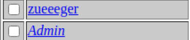

# 5. Qualitaetskontrolle
Folgende Commands können ausgeführt werden um zu testen, ob alles richtig funktioniert.

Status von Webmin überprüfen 
sudo service webmin status

Webmin re/starten 
sudo /etc/webmin/start

sudo service 
webmin restart

Webmin stoppen 
sudo service webmin stop

Konfiguration überprüfen 
cd /etc/webmin (Ordner von config files)

# 6. Error-Handling 

Wir hatten bei der Installation von Webmin keine grösseren Probleme

# 7. Quellen
Anleitung Installation Webmin
https://bscw.tbz.ch/bscw/bscw.cgi/31513531?op=preview&back_url=27527809

RaspberryPI OS
https://www.raspberrypi.org/software/

# 8. OpenSource Lizenz

 Dieses Werk ist lizenziert unter einer <a rel="license" href="http://creativecommons.org/licenses/by-nc-sa/3.0/ch/">Creative Commons Namensnennung - Nicht-kommerziell - Weitergabe unter gleichen Bedingungen 3.0 Schweiz Lizenz</a>

 

- - -